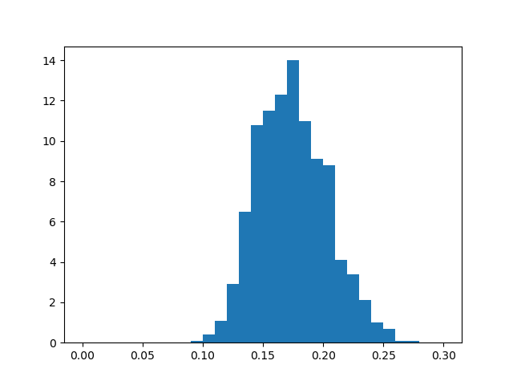
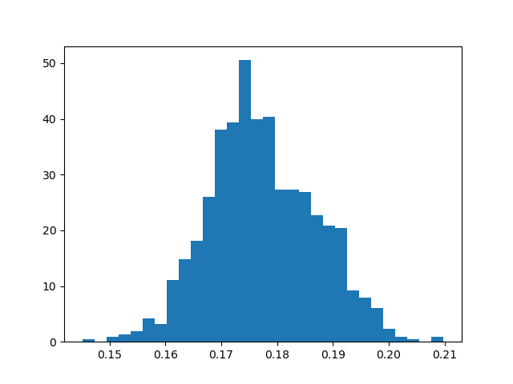
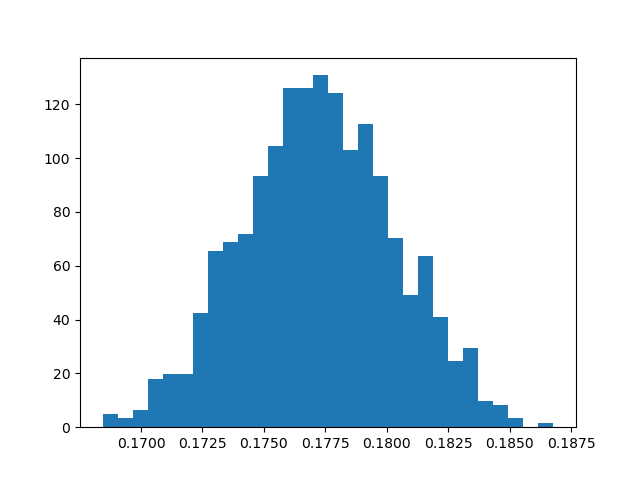
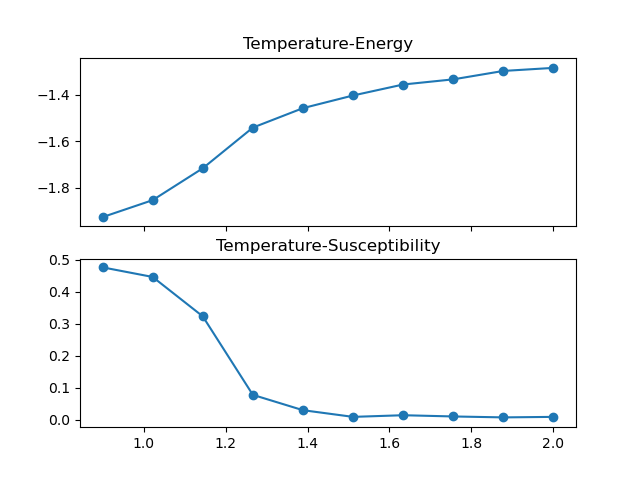
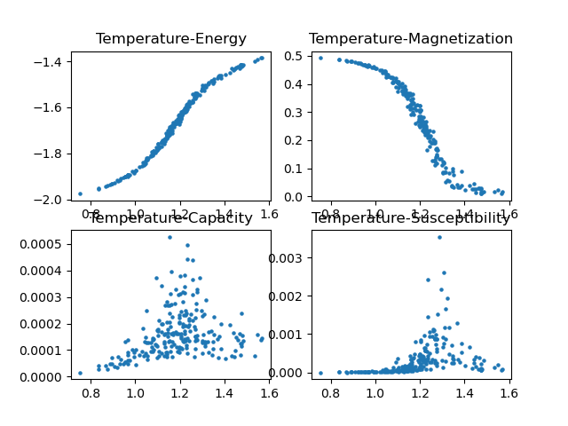

---
mode:passage
showtitle:true
title:计算物理第六次作业
date:2023/1/10
header : true
---
# 1.蒙特卡洛积分

利用蒙特卡洛法求积分,
$$
I=\int_D f(\v x)\rm d^n\v x
$$可在积分区域D内随机选取N个点$\v x_1,\v x_2\cdots\v x_n,\quad\v x_i\in D$.若选取得各个点概率是均匀的,则积分近似值为:
$$
I\approx \frac{V(D)}{N}\sum_{i=1}^n f(\v x_i)
$$
$V(D)$为区域$D$的体积.
#### 1.1 
每次取100个点,重复1000次,得到结果的频数分布直方图如下:

增加取点数到1000和10000,得到相应的频数分布直方图如下.可以看到,随着点数$N$增加,方差呈$\frac{1}{N}$的趋势减小,平均值也更加精确.

#### 1.2
取$10^7$个随机点,计算积分结果(见[T1_2.py](T1_2.py)),得出结果为:$1.317\times 10^{-7}$
真实值约为:$0.17724^{9}\approx 1.73\times 10^{-7}$

## 2. Potts Model
#### (1)

利用Metropolis算法,过程如下:设系统处于各个态的概率分布为$w_i(t)$,转移矩阵设为两个因子之积:
$$
W(j\to i)=T(j\to i)A(j\to i)
$$
根据转移矩阵性质,$\sum_i W(j\to i)= 1$.
其中$T(j\to i)$为$j$态向$i$态转移的概率,满足$\sum_i T_{ji}=1$;$A(j\to i)$为接受$j\to i$的概率
<!-- ,于是$i$态转移后留在$i$的概率为:
$$
\sum_j T(i\to j)(1-A(i\to j))
$$ -->
于是态的演化为(为方便起见,下面记$X(i\to j)=X_{ij}$):
$$
w_i(t+1) = \sum_j [w_j(t)T_{ji}A_{ji} + w_i(t)T_{ij}(1-A_{ij})]\\ 
w_i(t+1)-w_i(t)= \sum_j (W_{ji}w_j -W_{ij} w_i)\\ 
$$
平衡态要求$\D w_i(t)=0$,即$\sum_j w_jW_{ji}=\sum_j w_iW_{ij}=w_i$
为避免Markov过程中出现循环解,引入细致平衡:$w_jW_{ji}=w_iW_{ij}$
$$
\f {w_i}{w_j}= \frac{W_{ji}}{W_{ij}} = e^{-\beta (E_i-E_j)}
$$
其中用到了玻尔兹曼分布$w_i\propto e^{-\beta E_i}$,也是我们的目标分布.
从任意态$A=\{s_1s_2\cdots s_n\}$开始,随机选取一个分子$k$,改变它的状态从而使系统态为$B=\{s_1'\cdots s_n'\}$.
定义态之间的距离为1-norm:$||A-B||=\sum_k |s_k-s_k'|$
<!-- (或者$||A-B||={}^\#\{k|s_k\ne s_k'\}$?) -->

计算能量$\D E = E_A-E_B$,令接受概率为$A_{AB}$ ( 当 $||A-B||= 1$时 )为:
$$
A_{AB} = \begin{cases}
1,&E_A\le E_B\\ 
e^{-(E_B-E_A)/T},&E_A>E_B\\ 
\end{cases}
$$
转移概率$T_{AB}$可写为:
$$
T_{AB}=\begin{cases}
0, & A=B\ \text{or}\ ||A-B||\ge 2\\
\displaystyle\frac{1}{{}^\#\{B\mid ||A-B||=1\}}, & ||A-B||=1\\ 
\end{cases}
$$
其中${}^\#\left\{B\mid||A-B||=1\right\}$表示与态$A$距离为1的态个数
于是总的概率转移矩阵写为:
$$
W_{AB} = \begin{cases}
\frac{1}{{}^\#\{B\mid||A-B||=1\}}, & E_B\le E_A,||A-B||=1\\
\frac{1}{{}^\#\{B\mid ||A-B||=1\}}e^{-(E_B-E_A)/T}, & E_B\gt E_A,||A-B||=1\\ 
0,& ||A-B||\ge 2,\\
1-\sum_{B'\ne A}W_{AB'} &B=A
\end{cases}
$$

该模型的模拟程序见[T2_.py](./T2_.py)。分别对$10\times 10,40\times 40,80\times 80$的格子进行模拟，得到的结果如下图所示：
\img["T2_N%3D100%2C10x10%2C1e5-2e5_.png"]
40x40：
<!-- \img["T2_N1e5-2e5_.png"] -->
\img["T2_N%3D100%2C40x40%2C1e5.png"]

80x80:
\img["T2_N%3D100%2C80x80%2C1e5-2e5.png"]
热容作为内能对温度的导数，可以在图中看出在曲线转折点附近$T\approx 1.2$附近最大，这个转折点也对应了相变点。
#### (2)
Potts模型的哈密顿量可以写成：
$$
E=\frac{-J}{2}\sum_{<kl>}^N2\left(\del_{s_l,s_k}-\f 1 2 \right)-\sum_{<kl>}^{N}\frac{J }{2} 
$$
因此相变温度在$J/k_B=1$的条件下为$\frac{T_c}{2}= 1.135$
为了得到更精确的相变温度，对相变温度临近区间精密取点，由于在临界点附近达到热平衡速度很慢，因此增大统计步数到150万步，得到：

相变温度估计为$T_c\approx 1.2$左右，和实际相符
自变量温度改用高斯分布生成，得到散点图如下：

#### (3)
改变q的值为3,6,10，可能的能量差依然为：$\D E=4,2,0,-2,-4$。分别模拟得到：

q=3:
\img[T2_q%3D3.png]
此时估计相变在$T_c=1.0\sim 1.1$之间发生。

q=6:
\img[T2_q%3D6.png]
相变温度$T_c$约为$0.84$

q=10:
\img[./T2_q%3D10.png]
相变温度$T_c$进一步降低，达到$0.72$

通过归纳可以得出，q值越大相变温度越低。